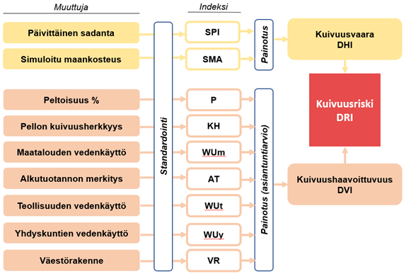
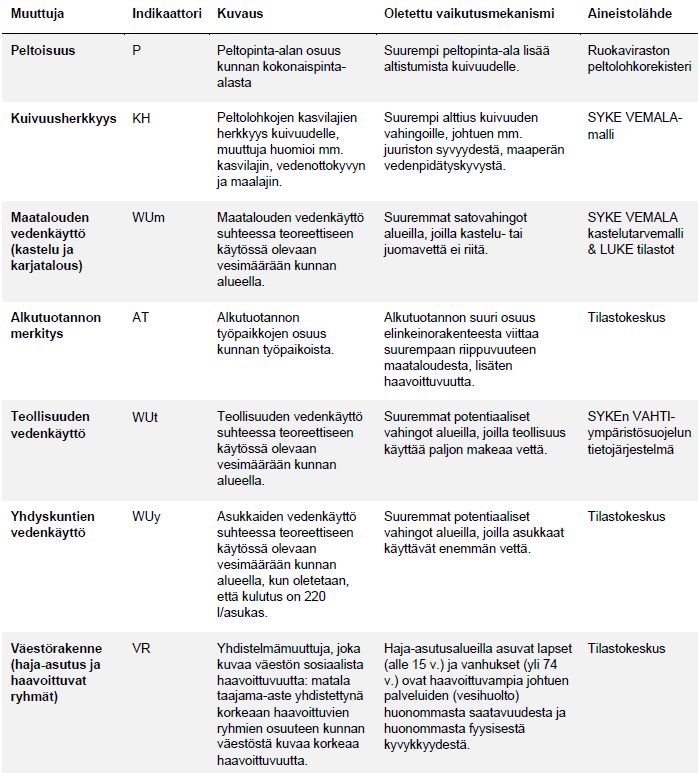

 

### Taustatietoa 

Visualisonnit on tuotettu SYKEssä osana maa- ja metsätalousministeriön rahoittamaa hanketta **KUHASUO - Kuivuusriskien hallinta Suomessa**.

Hankkeessa arvioitiin kuivuusriskiä Suomessa konseptuaalisella mallilla, joka koostuu kuivuusvaarasta ja kuivuushaavoittuvuudesta. Kuivuusvaaraindekseiksi valittiin meteorologista, hydrologista sekä maataloudellista kuivuutta kuvaavat standardoidut indeksit SPEI, SMA ja SRI. Kuivuusvaaraindeksi yhdistettiin maatalouden, teollisuuden ja yhdyskuntien kuivuushaavoittuvuutta kuvaavien muuttujien (7 kpl) kanssa. Työn ulkopuolelle jätettiin kuivuuden vaikutukset ympäristöön. Työssä ei myöskään tarkastella ilmaston muuttumista tulevaisuudessa. Työssä tarkastellaan historiallista meteorologista ja hydrologista havaintoaineistoa. Kuivuushaavoittuvuuden osalta tarkasteltiin nykytilannetta.

Valtakunnallisella kuivuusriskianalyysilla tuotetaan tietoa kansallisen kuivuusriskien hallinnan strategian laatimiseksi. Parempi ymmärrys kuivuustapahtumien vakavuudesta, kestosta ja toistuvuudesta auttaa ehkäisemään tai ainakin sopeutumaan paremmin potentiaalisten tulevaisuuden kuivuusjaksojen seurauksille.

Tulosten perustella tunnistetuilla korkeamman kuivuusriskialueilla voidaan riskien arviointia jatkaa tarkemmalla tasolla tai sektorikohtaisesti. Työssä sovellettuja kuivuusindeksejä hyödynnetään kuivuuden ennakkovaroitusjärjestelmän kehittämisessä (mm. Suomen ilmastoon sopivien indeksien ja niiden raja-arvojen määrittäminen).

Kuivuusriskien arvioinnilla tuotetaan tietoa kuivuusriskien hallinnan päätöksenteon tueksi ja pyritään löytämään toimenpiteitä, joilla kuivuuden vaikutuksia eri sektoreille voidaan vähentää etupainotteisesti ja kustannustehokkaasti. Kuivuusriskien hallinnan toimenpiteitä ovat mm. oikea-aikaiset vedensäästökehotukset, vesistöjen säännöstely ja kastelualtaat. 

### Kuivuusriskin määritelmä

Kuivuusriski määritellään vahingollisten seurauksien todennäköisyydeksi. Työssä sovellettiin konseptuaalista, indeksiperustaista IPCC:n määrittelemää riskimallia (Drought Risk Index = Hazard x Vulnerability). Mallin avulla pyritään huomioimaan sekä biofyysisiä (kuivuusvaara) että sosiaalistaloudellisia (kuivuushaavoittuvuus) tekijöitä mahdollisimman kattavasti. Riskin arvioimiseksi laskettiin vakavien kuivuuksien esiintymisen todennäköisyys. Lisäksi arvioitiin maatalouden, teollisuuden ja yhdyskuntien haavoittuvuutta kuivuudelle.

**Kuivuusvaaraa** (Drought Hazard Index, DHI) ja **kuivuushaavoittuvuutta** (Drought Vulnerability Index, DVI) kuvataan indeksien avulla. **Kuivuusriski** (Drought Risk Index, DRI) saatiin kuivuusvaaran (DHI) ja kuivuushaavoittuvuuden (DVI) yhdistelmänä. Kuivuusriskianalyysin menetelmää ja käytettyjä aineistoja kuvataan tiiviisti alla. 

***

### Aineisto ja menetelmät

#### Kuivuusvaara
Kuivuusvaaraa arvioitiin Ilmatieteen laitoksen __sadanta- ja lämpötilahavaintojen__ ja SYKEn vesistömallijärjestelmän simuloitujen (1962–2021) __maankosteuden__ ja __valunnan__ arvojen avulla. Arvot kuvaavat meteorologista, hydrologista sekä maataloudellista kuivuutta. Indeksit laskettiin käyttämällä alun perin sadanta-aineistolle (SPI) kehitettyä standardisoitua menetelmää (McKee ym. 1993). Indeksejä hyödynnetään tunnistamaan ja monitoroimaan kuivuutta. Indeksit (Standardized Precipitation and Evaporation Index (SPEI), Standardized Runoff Index (SRI) ja Soil Moisture Anomaly (SMA)) laskettiin SYKEn vesistömallijärjestelmällä kaikille kolmannen jakovaiheen valuma-alueille aikajaksolle 1962–2021 kuuden kuukauden aika-askeleella (esim. SPEI 6kk).

Kustakin kolmannen jakovaiheen indeksin aikasarjasta tunnistettiin kuivuusjaksoja, joille laskettiin niiden ominaisuudet. Tässä työssä kuivuusjaksot jaettiin neljään luokkaan niiden esiintymistodennäköisyyden ja intensiteetin mukaan (lievä, kohtalainen, vakava, erittäin vakava).

#### Kuivuushaavoittuvuus
Kuivuushaavoittuvuuden arvioinnissa hyödynnettiin monipuolisesti tilastoja. *Teollisuuden vedenkulutuksen* tilastot saatiin ympäristösuojelun tietojärjestelmä VAHTI:sta. *Yhdyskuntien vedenkäyttöä* arvioitiin suhteessa Tilastokeskuksen tilastoimaan väestömäärään teoreettisella asukaskohtaisella vedenkulutuksella. *Maatalouden vedenkulutuksessa* huomioitiin kasteluveden käyttö sekä karjatalouden käyttämä vesimäärä. Kasteluveden tarvetta arvioitiin SYKEn vedenlaadun ja ravinnekuormituksen mallinnus- ja arviointijärjestelmä VEMALA:lla, jonka avulla on mahdollista laskea peltolohkokohtaisesti teoreettista kastelutarvetta. Karjatalouden vedenkulutustiedot laskettiin Luonnonvarakeskuksen ylläpitämistä tilastoista elänimääristä. VEMALA-mallin aineistoja hyödynnettiin myös kuivuudelle haavoittuvien peltolohkojen tunnistamisessa. *Väestön haavoittuvuutta* (ts. haavoittuvien ihmisryhmien osuus taajama-alueiden ulkopuolella) sekä *alkutuotannon merkitystä elinkeinorakenteesta* kuvaavat muuttujat laskettiin Tilastokeskuksen kuntien avainluvut -tietokannasta.

*Kokonaishaavoittuvuusindeksin* muodostamiseksi yksittäiset haavoittuvuusmuuttujat tuli laskea yhteen ja painottaa keskenään. Mikäli muuttujia ei painoteta indeksin muodostamisessa, saa jokainen muuttuja yhtä suuren painoarvon osana kokonaisindeksiä. Visualisoinneissa näytetään painotettu haavoittuvuusindeksi. Muuttujien keskinäisessä painottamisessa hyödynnettiin asiantuntija-arviota, minkä jälkeen lopullinen indeksin tulos standardoitiin välille 0-1.

*Painottamisessa huomioitiin seuraavat asiat:*
*	Sektorin merkitys kuivuuden vaikutusten ja sen vaikutuksista selviämisen kannalta
*	Kuivuuden potentiaalisten vaikutusten mittaluokka ja laajuus
*	Veden tarve nykytilassa sekä mahdollinen tuleva tarve (huomioiden mm. ilmastonmuutoksen vaikutukset, väestönmuutos, talouskehitys, yms.)

Resilienssiä tai kuivuuden vaikutuksiin varautumista ei huomioitu kansallisessa haavoittuvuustarkastelussa, sillä siitä ei ole mahdollista saada kattavaa ja kuvaavaa aineistoa valtakunnallisesti. Resilienssin ja erilaisten varautumistoimien merkitystä kuivuusriskiin tulee arvioida tarkemmin alueellisessa tarkastelussa. Lisäksi painottamisessa pyrittiin välttämään korostamasta sellaisia muuttujia, joilla on pieni vaihteluväli.

**Kuva 1** - *Kuivuusriskianalyysin menetelmä. Kuvassa kuivuusvaara- ja haavoittuvuusmuuttujat, indeksit ja lopputuotos.*

**Kuva 2** - *Kuivuushaavoittuvuusanalyysiin valitut muuttujat, niitä kuvaavat indikaattorit, oletettu vaikutusmekanismi sekä aineistolähde.* 

#### Kuivuusriskikartat
Kartat tuotettiin yhdistämällä tieto kuivuusvaarasta (DHI) arvioon kuivuushaavoittuvuudesta (DVI). Menetelmäksi valittiin geometrinen keskiarvo, joka on yleisesti käytetty menetelmä yhdistelmä indeksiä laskettaessa. Kuivuusriski-indeksi (DHI) laskettiin kaavalla:

*DRI = (DHI ×DVI)^(1/2)*

Jos toinen DHI tai DVI indekseistä on nolla, kuivuusriskiä ei ole. Toisaalta, jos kuivuusvaara (DHI) tai kuivuushaavoittuvuus (DVI) on suurempi, johtaa se myös suurempaan kuivuusriskiin (DRI). Lopputuotoksena saaduilta kartoilta nähdään, kuinka kuivuusriski jakautuu Suomessa eri kuntien välillä.

***

### Sovelluksen käyttö

 
  
##### **Kartta**
* Kartalla kuvataan kuntakohtaisesti kuivuusvaara (DHI), kuivuushaavoittuvuus (DVI) ja kuivuusriski (DRI) omilla karttatasoillaan.Indeksit esitetään välillä 0-1. Mitä lähempänä arvo on numeroa 1, sitä suurempaa riski/vaara/haavoittuvuus on.
* Kuivuusvaarasta on tuotettu lisäksi kartat 3. jakovaiheen vesistöalueittain, mutta joita ei ole esitetty tässä sovelluksen versiossa. Ota yhteyttä, mikäli tarkempi analyysi kiinnostaa.
* Karttojen visualisoinnissa käytetään kvintiililuokitusta. Luokituksessa indeksin arvo on jaettu viiteen yhtä suureen luokkaan (ts. jokaisessa luokassa on yhtä monta havaintoa). Luokitustapa mahdollistaa parhaiten suhteellisten ilmiöiden tulkinnan (kuten haavoittuvuuden).

##### **Kuvaajat**
* Sivupaneelin ympyrädiagrammi kuvaa eri haavoittuvuusindikaattorien (7 kpl) osuutta kokonaishaavoittuvuusindeksissä. Kuvaajasta nähdään, kuinka suuri merkitys esimerkiksi maatalousmuuttujilla on kuivuushaavoittuvuuteen. Kokonaishaavoittuvuusindeksi esitetään välillä 0-1. Mitä lähempänä arvo on numeroa 1, sitä suurempaa haavoittuvuus on.
* Sivun alalaidan kuvaaja esittää TOP 20 haavoittuvinta kuntaa indeksin perusteella, sekä haavoittuvuusindikaattorien osuudet.

##### **Taulukko**
* Suomen kunnat ja arvioidut indeksien arvot kuivuusvaaralle (DHI), kuivuushaavoittuvuudelle (DVI) ja kuivuusriskille (DRI). 
* Tulosten tulkinnassa on hyvä muistaa, että indeksit sisältävät useita epävarmuuksia, joten tulokset ovat vain suuntaa-antavia. Tarkempi tulkinta vaatii yksityiskohtaisempaa tarkastelua.  
 
  

***
### Epävarmuuksia

* Työssä tarkasteltavan alueen laajuus (koko Suomi) sekä haavoittuvien sektoreiden määrä (maatalous, teollisuus, yhdyskunnat) tuovat lisähaasteen ja epävarmuutta tuloksiin. Yleistasoinen riskiarvio palvelee kuitenkin tarkoitustaan alueellista ja mahdollista sektorikohtaista jatkotyötä silmällä pitäen.

* Työssä tehtiin **kuivuusvaaratarkastelu** historialliseen meteorologiseen havaintoaineistoon sekä vesistömallijärjestelmän simuloimien maankosteuteen ja valuntaan perustuen. Ilmaston ja sitä kautta kuivuusvaaran muutoksia tulevaisuudessa ei tarkasteltu. Kuivuusvaaran osalta käytettiin kirjallisuudessa yleisesti hyviksi todettuja ja vakiintuneita indeksejä (SPI, SMA, SRI). Kuivuusvaaraindeksien laskennassa epävarmuutta luo sade- ja lämpötilahavaintoihin sopivan tilastollisen jakauman valinta. Työssä ei tarkasteltu Suomen ilmastolle mahdollista lumen sulamisesta aiheutuvaa hydrologista kuivuutta. Lumen sulamisesta aiheutuvaan kuivuuteen on kehitetty lumen vesiarvoon (SWE) perustuvia indeksejä. Hydrologinen kuivuusindeksi SRI huomioi ainoastaan valuntaa suhteessa keskimääräiseen halutulla aikajaksolla.

* **Kuivuushaavoittuvuusmuuttujilla** kuvattiin nykytilannetta (mm. vedenkulutus, asukasmäärät, ikäjakauma, viljelylajikkeet). Haavoittuvuuden muutosta tulevaisuudessa ei tarkasteltu. Kuivuushaavoittuvuusmuuttujat valittiin kirjallisuuskatsauksen perusteella. Haavoittuvuusmuuttujia oli kuivuusvaaraindeksien tavoin yleisesti käytössä useita erilaisia. Haavoittuvuusmuuttujien painotus toteutettiin asiantuntija-arvioihin perustuen, johon sisältyy epävarmuutta. Lisäksi muuttujien normalisointiin ja lähtötietoihin sisältyy omat epävarmuutensa.

* **Kuivuusriskianalyysin** tuloksia ei työssä validoitu, koska tietoa kuivuuksien vaikutuksista Suomessa on olemassa hyvin rajatusti. Kuivuuden vaikutuksia ei Suomessa tällä hetkellä dokumentoida säännönmukaisesti. Työssä hyödynnettiin saatavilla olevaa kirjallista dokumentaatiota vuosien 2002–2003 ja 2018 kuivuuksien vaikutuksista. Työssä ei myöskään tehty herkkyysanalyysiä

***

### Hyödyllisiä linkkejä  

Tietoa kuivuudesta: <a href="https://www.vesi.fi/vesitietokategoria/kuivuus" target="_blank">Vesi.fi-sivusto</a>  

Kuivuuden vaikutukset: <a href="https://www.vesi.fi/vesitieto/kuivuuden-vaikutukset/" target="_blank">Vesi.fi-sivusto</a>  

Tutkittua tietoa ilmastonmuutoksesta koottuna yhdelle sivustolle: <a href="https://ilmasto-opas.fi/fi/" target="_blank">ilmasto-opas.fi</a>  

Ajankohtaista vesitietoa Suomesta: <a href="https://www.vesi.fi/" target="_blank">Vesi.fi</a>  

***

### Yhteystiedot

Teknisissä asioissa voi olla yhteydessä sähköpostitse: sara.todorovic[at] syke.fi tai roy.snellman[at]syke.fi. 
Sovellus on tehty R:n <a href ="https://shiny.rstudio.com/" target="_blank">Shiny</a>-paketilla. Lähdekoodi on <a href="https://github.com/saratodo/drought-risk-finland" target="_blank">GitHubissa</a>.

 

***
